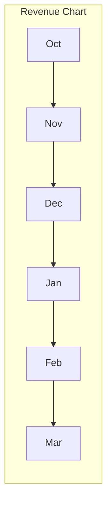
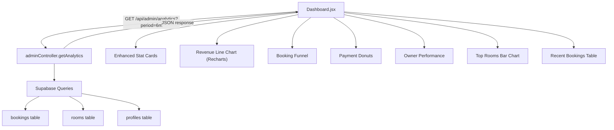

# Admin Analytics Dashboard Overhaul

## Current State

The dashboard ([frontend/src/admin/pages/Dashboard.jsx](frontend/src/admin/pages/Dashboard.jsx)) shows 4 `StatCard` components and a recent bookings table. Stats are computed client-side by fetching all bookings/rooms/users. The backend has a basic `GET /api/admin/dashboard-stats` endpoint ([backend/src/controllers/adminController.js](backend/src/controllers/adminController.js)) that only returns 4 counts (owners, customers, rooms, bookings).

## What to Build

### 1. Enhanced Backend Analytics API

Create a new `GET /api/admin/analytics` endpoint in [backend/src/controllers/adminController.js](backend/src/controllers/adminController.js) that computes all metrics server-side in a single call. This avoids fetching 200+ bookings to the client just to count them.

**Data to return:**

- **Revenue metrics**: total revenue, revenue this month, revenue last month, month-over-month growth %, revenue by payment method (Stripe vs cash)
- **Booking funnel counts**: total created, approved, confirmed, checked_in, checked_out, rejected, cancelled, no_show — these power the funnel chart
- **Time-series data** (last 6 months): monthly revenue and monthly booking count — powers the line/bar chart
- **Booking completion rate**: (checked_out / total non-cancelled) as a percentage
- **Payment breakdown**: paid, pending, failed, expired, pay_at_property counts
- **Top 5 rooms by revenue**: room title + total revenue
- **Top 5 owners by revenue**: owner name + total revenue + booking count
- **Today's snapshot**: bookings today, check-ins today, check-outs today

### 2. Frontend Chart Library

Install **Recharts** (`recharts`) — lightweight, React-native, works well with Tailwind, no heavy dependencies. It supports line charts, bar charts, pie/donut charts, and funnel visualizations.

### 3. New Dashboard Sections

Replace the current dashboard with these sections (top to bottom):

#### Section A: Enhanced Stat Cards (top row)

Keep the 4-card grid but with **richer data**:

- **Revenue** — show this month's revenue + % change from last month (green/red arrow)
- **Bookings** — total + today's count as subtitle
- **Completion Rate** — percentage of bookings that reached checked_out (the "success" metric you asked about)
- **Active Rooms** — total rooms with at least 1 booking this month

#### Section B: Revenue Over Time (line chart)

A line chart showing monthly revenue for the last 6 months. X-axis = month, Y-axis = revenue. Optionally a second line for booking count (dual axis).



#### Section C: Booking Funnel

A horizontal funnel/bar visualization showing how bookings flow through statuses:

```
Created (100%) -> Approved (75%) -> Confirmed/Paid (60%) -> Checked-In (50%) -> Checked-Out (48%)
                  Rejected (15%)    Cancelled (10%)         No-Show (2%)
```

This directly answers your question about "users who book then cancel" and "paid but never showed up." Each stage shows the drop-off.

#### Section D: Payment & Revenue Breakdown (side by side)

- **Left**: Donut chart — revenue split by payment method (Stripe online vs Pay at Property)
- **Right**: Donut chart — booking payment status distribution (Paid / Pending / Failed / Expired)

#### Section E: Owner Performance Table

A table showing top owners ranked by:

- Total revenue generated
- Number of bookings
- Completion rate (checked_out / total)
- No-show rate

Each row links to the owner's detail or impersonation. This answers your "check relevant things owner-wise" requirement.

#### Section F: Top Performing Rooms

A horizontal bar chart or ranked list of top 5 rooms by revenue, with booking count shown alongside.

#### Section G: Recent Bookings (keep existing)

Keep the current recent bookings table at the bottom.

### 4. Time Range Filter

Add a period selector at the top of the dashboard: "Last 7 days / Last 30 days / Last 6 months / All time" that re-fetches the analytics endpoint with a `period` query param.

## Architecture



## Files to Change

- **[backend/src/controllers/adminController.js](backend/src/controllers/adminController.js)** — Add `getAnalytics` controller with all the server-side aggregation queries
- **[backend/src/routes/admin.js](backend/src/routes/admin.js)** — Add `GET /analytics` route
- **[frontend/src/admin/pages/Dashboard.jsx](frontend/src/admin/pages/Dashboard.jsx)** — Complete rewrite with chart sections
- **[frontend/package.json](frontend/package.json)** — Add `recharts` dependency

No new files needed beyond the existing structure. No database schema changes required — all data already exists in the `bookings`, `rooms`, and `profiles` tables.

## What This Gives You

| Insight | How it's shown |

|---------|---------------|

| Revenue trends over time | Line chart (Section B) |

| Booking success/failure rate | Funnel chart (Section C) |

| Users who cancel after booking | Funnel drop-off at "Cancelled" stage |

| Users who paid but never showed | Funnel "No-Show" count + no-show rate |

| Owner-wise performance | Owner table with revenue, bookings, completion rate (Section E) |

| Payment method split | Donut chart (Section D) |

| Best performing rooms | Bar chart (Section F) |

| Month-over-month growth | Stat card with % change arrow |